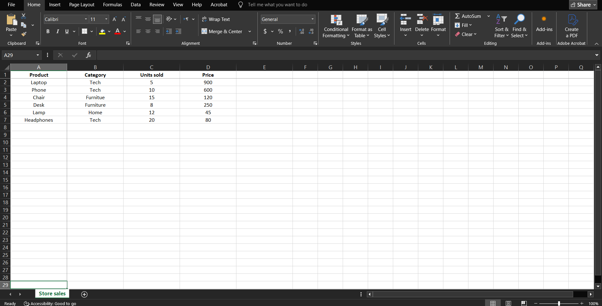
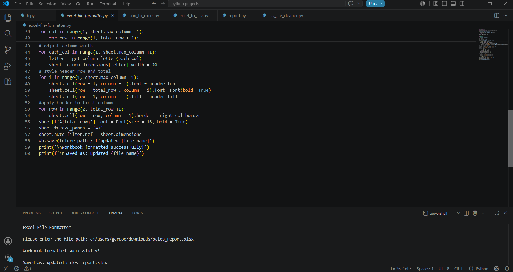
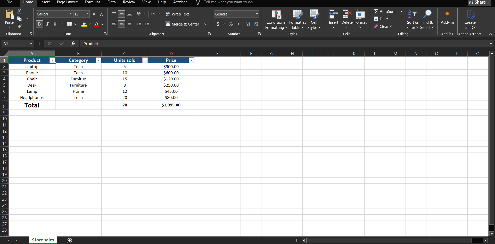

# 📊 Automated Excel File Formatter


A Python automation tool that transforms raw Excel spreadsheets into structured, formatted, and presentation-ready reports.

The program reads an existing workbook, applies automated formatting and calculations, then saves an updated copy without modifying the original file.

---

# 🖥️ Demo

### Raw Spreadsheet ➜ Automated Formatting ➜ Professional Excel Report

<p align="center">
  
  
</p>

<p align="center">
  
</p>

---

# 🎯 Problem

Business spreadsheets often require repetitive manual preparation before they can be shared or analyzed.

Tasks such as formatting headers, adjusting columns, applying currency formats, and calculating totals can consume unnecessary time when performed repeatedly.

---

# ✅ Solution

This tool automates Excel report preparation by:

- Applying consistent spreadsheet formatting
- Detecting financial-related columns
- Adding automatic SUM calculations
- Improving readability and navigation
- Creating a formatted copy while preserving the original workbook

---

# ⚡ Core Features

- 🛡️ **Safe File Processing**  
  Loads the original workbook and saves a separate formatted copy without overwriting the source file.

- 🧮 **Automatic Summary Calculations**  
  Detects common numeric columns and inserts Excel SUM formulas into a summary row.

- 💲 **Currency Formatting**  
  Applies currency formatting to detected financial columns such as sales, revenue, price, cost, and profit.

- 🎨 **Spreadsheet Formatting**  
  Applies header styling, alignment, borders, and improved column sizing for better readability.

- 🔍 **Navigation Improvements**  
  Freezes the header row and enables Excel filters for easier data browsing.

- 📁 **Automated Output Creation**  
  Generates the updated workbook automatically using the `updated_` naming format.

---

# 🛠️ Tech Stack

- **Language:** Python 3.x
- **Spreadsheet Processing:** `openpyxl`
- **File Handling:** `pathlib`
- **System Utilities:** `sys`

---

# 🚀 Quick Start

## 1. Clone the repository

```bash
git clone https://github.com/DevBlueprintLab/python-excel-file-formatter.git

cd python-excel-file-formatter
```

## 2. Install dependencies

```bash
pip install -r requirements.txt
```

## 3. Run the formatter

```bash
python excel_file_formatter.py
```

## 4. Provide your Excel file path

Example:

```text
Excel File Formatter
===============

Please enter the file path:
sample_data/sales_report.xlsx

Workbook formatted successfully!

Saved as:
updated_sales_report.xlsx
```

---

# 📁 Project Structure

```text
python-excel-file-formatter/

├── excel_file_formatter.py          # Main automation script
├── README.md                        # Project documentation
├── LICENSE                          # MIT License
├── requirements.txt                 # Project dependencies
├── sample_data/
│   └── sales_report.xlsx            # Example Excel workbook
└── images/
    ├── excel-input.png              # Original spreadsheet
    ├── formatting-process.png       # Formatting execution
    └── formatted-excel-output.png   # Final formatted workbook
```

---

# 💼 Practical Use Cases

This automation tool can help with:

- Preparing financial reports before sharing
- Formatting recurring Excel exports
- Improving spreadsheet readability
- Automating repetitive reporting tasks
- Standardizing business spreadsheets

---

# 🔮 Future Improvements

- Support formatting multiple worksheets
- Add date column detection
- Improve formatting customization options
- Generate charts from summary data
- Add GUI support for non-technical users

---

# 📜 License

This project is licensed under the MIT License.

---

Developed by **DevBlueprintLab**
